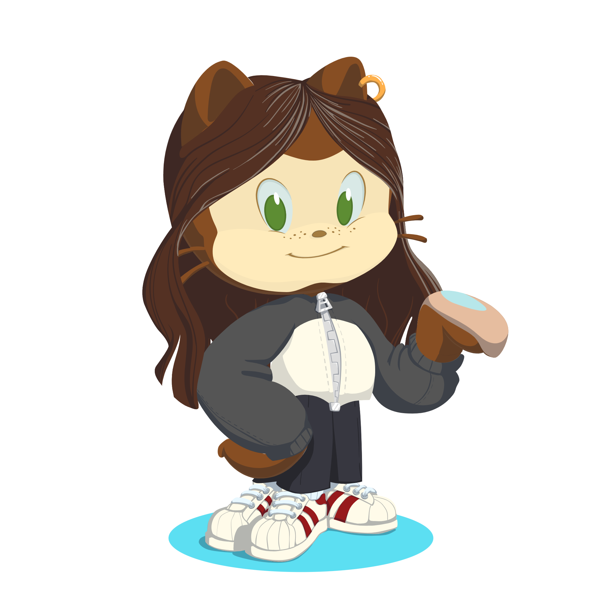

# Furniro Furniture

 
Compass UOL - FrontEnd Challenge: Furniro Furniture 

## Table of Contents

- [Challenge](#challenge)
- [Figma](#figma)
- [Tools](#tools)
- [Screenshots](#screenshots)
- [Difficulties](#difficulties)
- [Author](#author)

## Challenge

This challenge is from Compass UOL for the interns to complete and learn experiences. The main objective was to build a front-end development based on the design in Figma. 
To accomplish this task, it was used React with TypeScript application.

Furniro is a fictional furniture store with all categories of furniture products, from sofas to tables.  
This project contains the home page, with information about the Furniro shopping.  

To run this application, it's necessary to clone this repository and install all the dependencies (wich can be seen in [*tools content*](#tools)).  
To run the JSON server, it's necessary to use the command "npx json-server ./mock/_database.json" to access the mock api.

## Figma

The challenge was based accordingly to the design and user interface in 🔗[Figma](https://www.figma.com/design/E1F9AbyIRppkO2Ro1oP2tj/Desafio-3?node-id=117-336&t=kFuD7FGniomCe5mR-0)

## Tools

🔨 <b>React with VITE</b> 
🔨 <b>TailwindCSS</b> 
🔨 <b>TypeScript</b> 
🔨 <b>React Router Dom</b> 
🔨 <b>JSON server</b> 
🔨 <b>Firebase</b> 
🔨 <b>Axios</b> 

## Screenshots

### Desktop Screen

### Mobile Screen

## Difficulties

While developing this web page, I faced some challenges that helped me to learn experience. Here are some examples:

- To create the Donate and Adopt Modals: I was not familiar to the tag < dialog >, and I had to do a search about how it works and how to open and close the Modals
- To style the radio inputs in the payment method in the Donate Modal: Basic, I had to disable the appearance of the input and do a style in the label, increasing the hit area to select the radio.
- The forms validation: To prevent the forms being submitted without the correct information, I had to manipulate the input values with regular expressions (regex), which was something new for me. With the correct pattern, the forms can be submitted.
- This project don't have mobile version: The responsive design was optional and I didn't have time to do it, so I intend to do it later.

These experiences and more that I didn't list taught me valuable lessons in adaptability and perseverance, enhancing my web delevopment skills.

## Author

- LinkedIn - [Camila Katayama](https://www.linkedin.com/in/camila-katayama-ab1a42153/)
- GitHub - [@camilakataa](https://github.com/camilakataa)

